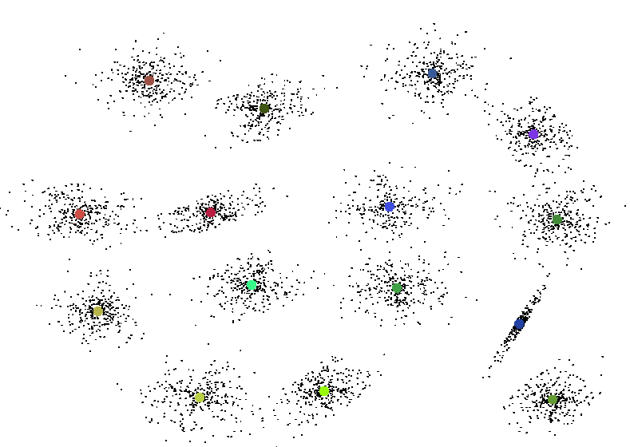
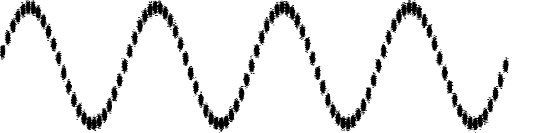
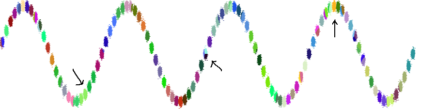

# Introduction
This repository contains the algorithms I implemented during clustering methods course in 2017 with 
added tests and slight modifications. I also reran some of my original benchmarks on a more powerful machine.
Some of the tests involve a random element which may cause failures in rare cases.

The algorithms take in numeric data vectors and attempt to find
clusters in the data. The calculated centroid locations are written to a file. Each data vector can be
assigned to a cluster based on the nearest centroid.

Course page: http://cs.uef.fi/pages/franti/cluster/

Datasets from: http://cs.uef.fi/sipu/datasets/ (spring 2017). Included in repository for convenience.

# Instructions for running
You can build the project with Gradle, or by do executing `javac Clustering.java` in the source folder (in which
case the class files will be dumped in the same directory).

Run by executing: `java Clustering <input file> <number of clusters>` in whichever directory the class files are located.
Or alternatively, take a look at "run kmeans.bat" file.

Additional options: 
    
    -c <known centroids file name>
        The real centroids can be used to assess clustering performance by comparing the calculated centroids to known
        ones. Measured with "centroid index" score (CI).
    -r <number of repeats>
        Since the initial position of the centroids is randomized, repeated runs of the chosen algorithm can improve the
        clustering result.
    -o <output file name>
        The output file contains the calculated centroids.
        default: <input file name>-centroids.txt
    -a <algorithm name> 
    	fkm 	- fast k-means (default)
    	rs      - random swap
    	sr      - stochastic relaxation
    	km      - normal k-means

# Algorithms
## k-means
Standard k-means algorithm ([wikipedia](https://en.wikipedia.org/wiki/K-means_clustering)). 
- k centroids are initialized as random data vectors
- Iterate until the centroids don't change (convergence): 
    - Assign each data vector to its nearest centroid (partition)
    - Move each centroid to the mean of its assigned data vectors

The result of the k-means clustering algorithm depends heavily on the initial conditions. Typically the
algorithm converged to a local minimum which can be far from globally best solution. The quality of solution
can be measured in terms of the total squared error of distances between the centroids and their assigned data vectors.
Sometimes the algorithm is run multiple times to find a better solution.
## Fast k-means
Based on paper _T. Kaukoranta, P. Fränti and O. Nevalainen, "A fast exact GLA based on code vector activity detection", 
IEEE Trans. on Image Processing, 9 (8), 1337-1342, August 2000._ 

The traditional k-means algorithm does unnecessary distance comparisons between data vectors and centroids:
- if a vector's nearest centroid is C1, and centroids C1, C2 have not moved between iterations, then C2 cannot be the nearest centroid on the next iteration
- additionally, if C1 has moved towards the vector and C2 has stayed still, the same rule applies.

To implement this, we need to keep track of centroids that are not moving and the previous distances between data vectors and centroids.

The paper also mentions other ways to speed up the search but those were not implemented here.
## Random swap
This was another algorithm introduced during the course. It introduces a method for overcoming the problem of a local minimum.
- k centroids are initialized as random data vectors
- Iterate (for x number of iterations or x amount of time): 
    - store current total square error and current centroid positions
    - select a random centroid and move it to a position of a random data vector
    - repeat k-means iteration twice:
        - Assign each data vector to its nearest centroid
        - Move each centroid to the mean of its assigned data vectors
    - see if the total square error decreased; if not, revert changes made to the centroid

In the traditional k-means algorithms, the centroids do not move far from their starting positions.
The random swap step introduces large changes in the centroid positions and can improve the result drastically. However,
it takes luck (or time) to find a good swap.
## Stochastic relaxation
Based on paper _K. Zeger and A. Gersho, "Stochastic Relaxation Algorithm for Improved Vector Quantiser Design", Electronics Letters, 25 (14), 896-898, July 1989._

This algorithm has another way of introducing perturbations to the centroids in order to move them away from a local minimum.

The algorithm consist of the typical k-means step, and then the centroids are moved in random directions. The amount of movement
decreases as the algorithm is iterated so that the algorithm can converge to a stable position. The amount of movement is
governed by a "temperature" variable.

- k centroids are initialized as random data vectors
- Iterate while total squared error decreases: 
    - Assign each data vector to its nearest centroid (partition)
    - Move each centroid to the mean vector of its assigned data vectors
    - Calculate temperature based on current iteration count
    - Move centroids around their position randomly, scale the movement based on temperature
- do traditional k-means until convergence

The iteration condition of "while total squared error decreases" may not be a good choice, because the random changes to the 
centroids may increase the error in some cases. However, the algorithm appears to work well enough, especially when
repeated a few times. The random perturbations are good at making improvements to the local positions of the 
centroids. However, the algorithm is not capable of making larger changes.
# Datasets
The datasets used are synthetic apart from the bridge set. Most of the data is 2-dimensional. The datasets are in text
format where each line is a single vector, and different components are separated by spaces/tabs.
- S1-S4: 5000 vectors, 15 clusters. S1: little spread/overlap, S4: a lot of spread/overlap
- A1-A3: 3000, 5250, 7500 vectors; 20, 35, 50 clusters (150 vectors each cluster)
- birch2: 100,000 vectors, 100 clusters. The clusters are placed on a sin-function graph. Very little overlap between 
clusters and it is difficult to find a decent result using k-means.
- unbalance: 3 clusters with 2000 vectors each, 5 clusters with 100 vectors each
- dim032: 32-dimensional data, 1024 vectors, 16 clusters
- bridge: 4096 vectors, 16 dimensions. 4x4 pixel blocks from a grayscale image in a vector form. No real clusters, the
vectors form a larger "blob". A real world use case for this dataset could be quantization of values rather than
trying to detect any actual cluster formations in the data.

___An example clustering of birch2___ 

When using the k-means algorithm, it can be seen that many neighboring clusters have been combined together and some 
clusters have been split into multiple parts (not all of them are marked). 
Please note that many differing colors may have a very similar hue.

On the other hand, the random swap algorithm performs much better with only a few erroneous clusters:

# Benchmarks
Some quick benchmarks done on an i7-9700k processor.

5 minute runtime. A single instance of the random swap algorithm was run for the 5 minutes. The other algorithms
were repeated as many times as possible within the same time frame. 

Mean Squared Error metric was used: for each data vector, calculate the squared distance to the nearest cluster centroid 
and sum these distances. For a quality result, the distances should be minimized.

|DATASET| vectors/clusters| k-means|fast k-m|Rnd swap|St. rel.|
|-------|-----------------|--------|--------|--------|--------|
|S2     |5000/15          |2.66E9  |2.66E9  |2.66E9  |2.66E9  |
|birch2 |100000/100       |9.80E6  |9.52E6  |**4.57E6**  |**5.40E6**  | 
|bridge |4096/256         |2810    |2811    |**2615**    |**2589**    |
|unbalance|6500/8         |3.30E7  |3.30E7  |3.30E7  |3.30E7  |

10 second runtime. Keep in mind that there was no multiple run averaging here, which may skew the results.

|DATASET| vectors/clusters| k-means|fast k-m|Rnd swap|St. rel.|
|-------|-----------------|--------|--------|--------|--------|
|S2     |5000/15          |2.66E9  |2.66E9  |2.66E9  |266E9   |
|birch2 |100000/100       |1.22E7  |1.15E7  |**5.25E6**  |~~7.27E6~~ (15s)|
|bridge |4096/256         |2846    |2819    |2722    |**2603**|
|unbalance|6500/8         |6.79E7  |6.93E7  |3.30E7 | 3.30E7 

In some cases, the random swap algorithm takes a while to find a good swap, in which case its
performance is less than ideal. It should also be noted that the stochastic relaxation algorithm may take a couple of
seconds to run on the larger datasets, which may be undesirable in some use-cases. However, its first result
is often quite decent. The k-means algorithms run much quicker but may produce a worse result, and the final result
of the 10 second session depends on lucky selection of initial centroids.

The main difference between the perturbations of the random swap and the stochastic relaxation algorithm is that
the random swap algorithm introduces large global changes in cluster centroids, whereas stochastic relaxation introduces 
smaller local changes. The *bridge* dataset does not have well-defined clusters and most of the data is in a singular 
large formation, which makes the stochastic relaxation algorithm work well on that dataset. On the other hand, *birch2* 
has very spread out clusters with little overlap, which means improving the initial conditions requires larger changes
in the centroids. 
